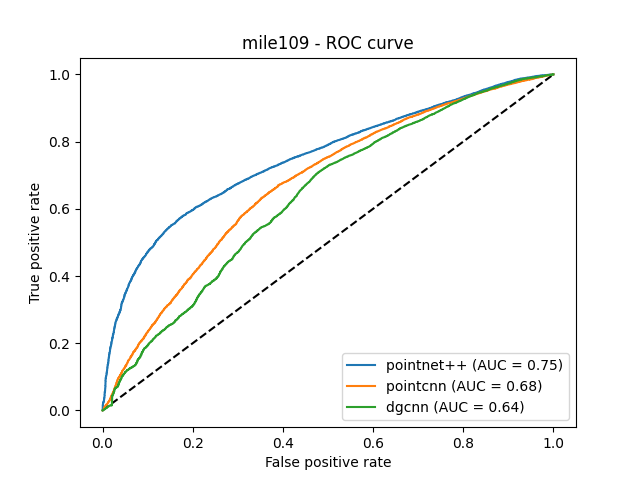

<div align="center">

# 3D ML Rockfall Susceptibility Modelling

[](https://github.com/pre-commit/pre-commit)
[](https://www.tensorflow.org/)
[](https://www.open3d.org/)
[](https://hydra.cc/)
[](https://opensource.org/license/mit)


Official implementation for
<br>
<br>
[_Slope-Scale Rockfall Susceptibility Modeling as a 3D Computer Vision Problem_](https://www.mdpi.com/2072-4292/15/11/2712) (Remote Sensing)
<br>
[](https://www.mdpi.com/2072-4292/15/11/2712)
<!-- [](https://doi.org/10.5281/zenodo.8042712)
[](https://drprojects.github.io/superpoint-transformer) -->
<br>
</div>

<br>

## 📌  Description

<p align="center">
  
</p>

**3D ML Rockfall Susceptibility Modelling (RSM)** is an approach to 3D RSM as a point cloud **semantic segmentation (PCSS)** problem. 3D geometric learning neural networks 🤖 are employed for analyzing points clouds to interpret high-resolution digital observations capturing the evolution of a rock slope via long-term, LiDAR-based differencing. The implementation includes the [PointNet++](https://arxiv.org/abs/1612.00593), [PointCNN](https://arxiv.org/abs/1801.07791), and [DGCNN](https://arxiv.org/abs/1801.07829) modules. Detailed applications of the models and analysis results on real rockfall monitoring cases are demonstrated in our [paper](https://www.mdpi.com/2072-4292/15/11/2712) .
The repository includes components of the TensorFlow 2 layers provided [here](https://github.com/dgriffiths3/pointnet2-tensorflow2) and the TensorFlow operations provided [here](https://github.com/charlesq34/pointnet2/tree/master/tf_ops).

<div align="center">
  
</div>

<br>

## 💻  Environment requirements
This project was tested with:
- Linux OS (Ubuntu 18.04)
- **64G** RAM
- NVIDIA GeForce RTX 2070 **8G**
- CUDA 10.1
- conda 23.3.1

<br>

## 🏗  Installation
Simply run [`install.sh`](install.sh) to install all dependencies in a new 
conda environment named `3d-ml-rsm`. 
```bash
# Creates a conda env named '3d-ml-rsm' env and installs dependencies
./install.sh
```

# <sub>Data preparation
The training data for the models should represent rock slope areas that include both stable and unstable points (points that belong to rockfalls) resulted from point cloud based change detection after de-noising and clustering. Details on the data generation workflow are provided [here](https://www.mdpi.com/2220-9964/10/3/157). When both <code>rockfall</code>  and <code>non_rockfall</code> points are are detected, make sure that the extracted point clouds <code>(.txt)</code> containing the rockfall points, inlude the cluster ID in the last column. Also, the original rock slope models be  saved in <code>.pcd</code> format. Then copy them in the respective folders following the steps below:
  1) Create a folder called <code>data</code>
  2) In <code>data</code>, create two folders named <code>models</code> and <code>rockfalls</code>
  3) Paste the <code>.pcd</code> files of the raw point clouds in the <code>models</code> folder created in (2)
  4) Paste the <code>.txt</code> files of the rockfall points and the cluster IDs in the <code>rockfalls</code> folder created in (2).

  # <sub><sub>Naming convention
  For every change detection analysis, for instance, between January 1st, 2022 and January 1st, 2023, both the raw point clouds and the resulted rockfall file should be named after the dates, as follows:
  - **Reference point cloud:** 2022-01-01.pcd
  - **Compared point cloud:** 2023-01-01.pcd
  - **Rockfall file:** 2022-01-01_to_2023-01-01.txt
  
  Then, open the <code>dataset/dataset.py</code> file and modify the <code>train_file_prefixes</code>, <code>dev_file_prefixes</code>, and <code>test_file_prefixes</code> lists to split your models according to which captures you want to be part of the training, development, and test sets, respectively.
  
Now, you are ready to sample the training examples and create the Tensorflow records by executing:
<pre><code>python parser.py
</code></pre>
<pre><code>python create_dataset.py --box_size ## --points_per_box ### --batch_size ####
</code></pre>
where <code>##</code> is the size of each sampling box in meters (default=10), <code>###</code> the number of points to be sampled from each box (default=512), and <code>####</code> the batch size of the dataset (default=16).
  
!!! At this point, paste the full point cloud of the selected test captures into the <code>dataset/parsed</code> folder with a <code>_full</code> ending (e.g., 2022-01-01_full.pcd)

# <sub>Training
To train a model with the parsed data, simply run the <code>train.py</code> script with the following arguments:
  - **model:** string data type that can be either <code>pointnet++</code>, <code>pointcnn</code>, or <code>dgcnn</code>
  - **epochs:** integer defining the number of training epochs
  - **batch_size:** intereger defining the size of each batch of data (default=16)
  - **point_per_box:** integer defining the number of points sampled from each box and MUST be same with <code>create_dataset.py</code> (default=512)
  - **lr:** float defining the learning rate (default=0.0001)
  - **logdir:** directory to save the trained models in a folder called <code>logs</code> (default=the selected model name)

Here is an example for training a PointNet++ model for 100 epochs and the default settings:
  <pre><code>python train.py --model pointnet++ --epochs 100</code></pre>

The weights of every epoch are saved in the <code>logs</code> folder under the subfolder named by the <code>logdir</code> input argument (<code>pointnet++</code> in the example above as it uses the defaults value).
  
The training logs can also be viewed by executing:
<pre><code>tensorboard --logdir=logs</code></pre>
and navigate to <code>http://localhost:6006/</code>.

# <sub>Inference
To infer on the test data, simply run the <code>predict.py</code> script with the following arguments:
  - **model:** string data type that can be either <code>pointnet++</code>, <code>pointcnn</code>, or <code>dgcnn</code>
  - **epochs:** integer defining the epoch which's the trained weights will be used to make predictions
  - **batch_size:** intereger defining the size of each batch of data (default=16)
  - **box_size:** integer defining the size of each sampling box in meters and MUST be same with <code>create_dataset.py</code> (default=10)
  - **point_per_box:** integer defining the number of points sampled from each box and MUST be same with <code>create_dataset.py</code> (default=512)
  - **logdir:** directory to save the trained models in a folder called <code>logs</code> (default=the selected model name)
  - **evaluate:** boolean defining whether the model will be evaluated on the test set or simply create predictions on the full versions of the test captures.
  - **save_eval:** boolean defining whether the evaluation scores will be saved. If set to <code>False</code>, the scores are only printed to the terminal. (default=False)

Here is an example for evaluating the performance of the PointNet++ model on the 50th epoch:
  <pre><code>python predict.py --model pointnet++ --epochs 50 --evaluate True</code></pre>
  
Here is an example of using the above trained and evaluated PointNet++ for creating rockfall susceptibility maps on the full test captures:
  <pre><code>python predict.py --model pointnet++ --epochs 50 --evaluate False</code></pre>
  
The predictions are saved in a homonym folder.
